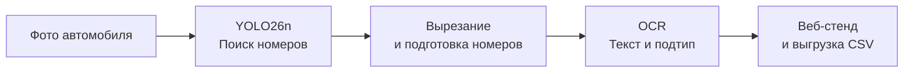

# Распознавание нестандартных ГРЗ

YOLO26n находит номера на изображении, OCR распознаёт текст и определяет подтип. Основной фокус — обычные номера `type1`, двухстрочные `type1a` и жёлтые `type1b`. Проверять результат можно через веб-стенд.

## Быстрый старт: запустить стенд

Нужен Python 3.11+ (проверено на 3.14) и готовые веса `checkpoints/plate_detector.pt` и `checkpoints/plate_recognizer.pt`. Они находятся в текущей копии проекта.

Команды выполняются **из корня проекта в PowerShell**:

```powershell
python -m venv .venv
.\.venv\Scripts\Activate.ps1
python -m pip install -r generator/requirements.txt
python -m pip install torch==2.14.0 --index-url https://download.pytorch.org/whl/cu126
python -m pip install ultralytics==8.4.150 fastapi uvicorn python-multipart tqdm
python full_stand/app.py --port 8080
```

Дождитесь запуска сервера и откройте **[http://127.0.0.1:8080](http://127.0.0.1:8080)**. Перетащите фотографии в окно: стенд покажет найденные номера, текст, тип и уверенность распознавания. Результаты можно выгрузить кнопкой CSV.

Стенд автоматически использует GPU, если доступна CUDA, иначе работает на CPU. Для принудительного запуска без GPU добавьте `--device cpu`. После установки зависимостей и подготовки весов интернет для работы стенда не нужен.

## Как это работает

Каждое изображение проходит через детектор и распознаватель. Если в кадре несколько номеров, результат формируется для каждого из них.



1. **Поиск номера.** YOLO26n находит рамки номерных знаков на исходной фотографии. У детектора один класс — номер; его текст и подтип определяются следующим этапом.
2. **Распознавание.** Каждый найденный номер вырезается с небольшими полями и приводится к подходящему размеру с учётом соотношения сторон. OCR на основе трансформера определяет подтип и последовательно читает символы, учитывая допустимые буквы и цифры для каждой позиции.
3. **Вывод результата.** Стенд показывает рамки на исходном изображении, вырезанные номера, распознанный текст, подтип и уверенность моделей. Изображения обрабатываются через очередь, результаты появляются по мере готовности.

OCR различает 29 подтипов по каталогу ГОСТ и класс `unknown`. Это позволяет отдельно определять обычные, двухстрочные, жёлтые, военные и другие номера. В CSV сохраняется полный подтип вместе с текстом и оценками уверенности.

## Какие данные используются

**Детектор** обучается на фотографиях с размеченными рамками номеров. **OCR** — на вырезанных реальных номерах с текстовой разметкой и синтетике собственного генератора.

| Задача | Источник | Изображений после отбора |
|---|---|---:|
| Детекция | [AUTO.RIA / Nomeroff Net](https://nomeroff.net.ua/), архив 2026-06-04 | 19 888 |
| Детекция | [Car_plate_detecting_dataset](https://huggingface.co/datasets/AY000554/Car_plate_detecting_dataset) | 24 822 |
| Детекция | [Car plate object detection](https://www.kaggle.com/datasets/andrewteplov/car-plate-object-detetcion) | 482 |
| Детекция | [Number plates, 50% Russian / 50% others](https://www.kaggle.com/datasets/kirillpribludenko/number-plates-50-russain-50-others) | 369 |
| OCR | [AUTO.RIA OCR RU, 2021-09-01](https://web.archive.org/web/20220514070933id_/https://nomeroff.net.ua/datasets/autoriaNumberplateOcrRu-2021-09-01.zip), гражданские номера | 56 611 |
| OCR | [AUTO.RIA OCR RU Military, 2022-03-25](https://web.archive.org/web/20220514075608id_/https://nomeroff.net.ua/datasets/autoriaNumberplateOcrRu-Military-2022-03-25.zip), военные номера | 27 513 |
| OCR | [Car_plate_OCR_dataset](https://huggingface.co/datasets/AY000554/Car_plate_OCR_dataset), уникальная часть | 4 747 |

Готовые выборки:

- `real_plates/plates/` — детекция, YOLO-разметка с одним классом: **43 284 train / 2 277 val**.
- `real_plates/ocr_plates_ru/` — OCR, изображения и файлы `train.tsv`, `val.tsv`: **84 427 train / 4 444 val**.

Дубликаты удалены до разделения на train/val, кириллица в OCR приведена к латинским символам того же начертания. Сборка выполняется собственными скриптами: источники дедуплицируются по содержимому файлов, затем режется сплит. В сборщиках нужно заменить абсолютные пути на свои; выход детекции по умолчанию называется `yolo_plates_ru`, в текущей копии он размещён в `plates`.

## Как сгенерировать данные

Используйте окружение из быстрого старта. Основной вариант генерации работает через **Blender Cycles на NVIDIA GPU**. Подготовьте Blender, затем создайте выборку:

```powershell
python -m generator.setup --blender
python -m generator generate outputs/synthetic --count 5000 --seed 42 --backend cycles --device CUDA --profile gost --preview
python -m generator validate outputs/synthetic
```

Для небольшой пробы уменьшите `--count`, например до 32. Генерация через `--backend cpu` доступна без Blender и GPU — в этом случае первый шаг можно пропустить.

Генератор выбирает тип и текст номера, строит знак по геометрии ГОСТ, затем моделирует съёмку: меняет ракурс, освещение, загрязнение, блики и смаз. Вместе с изображением автоматически создаётся разметка текста, типа и положения знака. Так можно дополнить реальные данные примерами редких типов и разных условий съёмки.

Для текущего OCR используется профиль `gost`. Количество задаётся через `--count`, seed — через `--seed`; только целевые типы можно выбрать через `--types type1 type1a type1b`.

В `outputs/synthetic/` появятся изображения, разметка `annotations.jsonl`, конфигурация и отчёт о генерации. Посмотреть примеры можно в `preview.jpg` или `gallery.html`. Этот же каталог передаётся в обучение OCR.

## Как обучить модели

Примеры ниже рассчитаны на **одну NVIDIA GPU** и окружение из быстрого старта. Для OCR сначала сгенерируйте синтетику командой выше.

### Детектор

В `real_plates/plates/data.yaml` замените значение `path` на абсолютный путь к вашему каталогу `real_plates/plates`. Если собирали данные заново в `yolo_plates_ru`, используйте `data.yaml` из этого каталога.

```powershell
yolo detect train model=yolo26n.pt data=real_plates/plates/data.yaml `
    epochs=400 patience=40 imgsz=640 batch=16 device=0 project=outputs name=detector
```

Начальные веса `yolo26n.pt` скачиваются автоматически. Лучшие веса сохраняются в `outputs/detector/weights/best.pt`; при повторных запусках имя каталога может получить числовой суффикс.

### OCR

Обучение на реальных номерах и сгенерированных изображениях, валидация — на отдельной реальной выборке:

```powershell
python ocr_model/run_training.py `
    --data real_plates/ocr_plates_ru/train.tsv outputs/synthetic `
    --val-data real_plates/ocr_plates_ru/val.tsv `
    --output outputs/ocr --epochs 25 --gpus 0 --batch-size 32 --workers 4
```

Лучшие веса сохраняются в `outputs/ocr/best.pt`, последние — в `outputs/ocr/last.pt`. Для проверки одного шага добавьте `--dry-run`. При нехватке видеопамяти уменьшите батч; если GPU не поддерживает BF16, добавьте `--amp none`.

Для обучения только на реальных данных уберите `outputs/synthetic` из команды. Передавайте `train.tsv` и `val.tsv` отдельно, чтобы сохранить готовое разделение данных.

Это пример нового обучения. Полная синтетическая выборка, использованная для поставляемых OCR-весов, в текущей копии проекта отсутствует.

### Проверить свои модели на стенде

```powershell
python full_stand/app.py `
    --detector outputs/detector/weights/best.pt `
    --recognizer outputs/ocr/best.pt --port 8080
```

Откройте тот же адрес [http://127.0.0.1:8080](http://127.0.0.1:8080) и загрузите изображения для проверки.

Полный список параметров доступен через `--help` у соответствующей команды.
